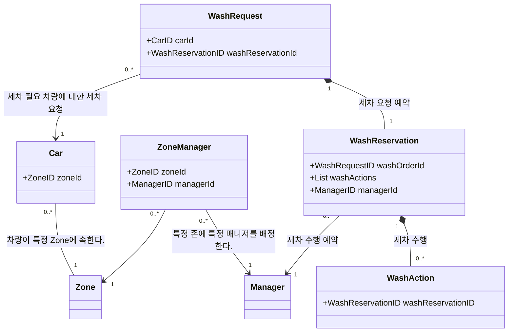

# Class Diagram

```mermaid
classDiagram
    class Car {
        +ZoneID zoneId
    }
    
    class Zone {
    
    }
    
    class Manager {
   
    }
    
    class WashRequest {
        +CarID carId
        +WashReservationID washReservationId
    }
    
    class WashReservation {
        +WashRequestID washOrderId
        +List<WashAction> washActions
        +ManagerID managerId
    }
    
    class WashAction {
        +WashReservationID washReservationID
    }
    
    class ZoneManager {
        +ZoneID zoneId
        +ManagerID managerId
    }
    
    Car "0..*" -- "1" Zone : 차량이 특정 Zone에 속한다.
    
    ZoneManager "0..*" --> "1" Zone
    ZoneManager "0..*" --> "1" Manager : 특정 존에 특정 매니저를 배정한다.

    WashRequest "0..*" --> "1" Car : 세차 필요 차량에 대한 세차 요청
    WashReservation "0..*" --> "1" Manager : 세차 수행 예약
    WashRequest "1" *-- "1" WashReservation : 세차 요청 예약
    WashReservation "1" *-- "0..*" WashAction : 세차 수행
```
