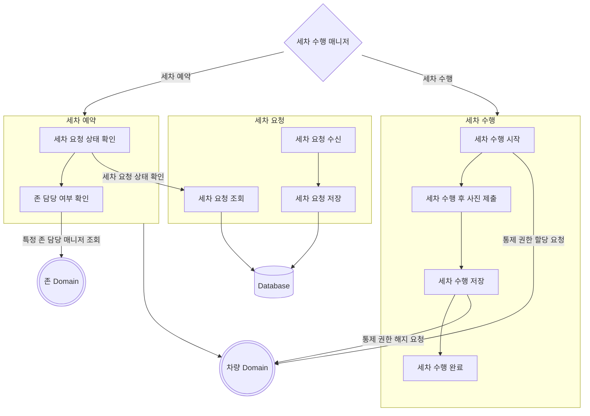

# Domain Model

```mermaid
flowchart TD
    M{"세차 수행 매니저"}
  
    Z(((존 Domain)))
    C(((차량 Domain)))

    subgraph WO["세차 요청"]
        WO1["세차 요청 수신"] --> WO2["세차 요청 저장"]
        WO3["세차 요청 조회"]
    end

    WO2 --> DB[(Database)]
    WO3 --> DB

    subgraph WR["세차 예약"]
        WR1["세차 요청 상태 확인"] --> WR2
        WR2["존 담당 여부 확인"]
    end

    subgraph WA["세차 수행"]
        WA1["세차 수행 시작"] --> WA2["세차 수행 후 사진 제출"]
        WA2 --> WA3["세차 수행 저장"]
        WA3 --> WA4["세차 수행 완료"]
    end

    M -- "세차 예약" --> WR
    WR --> C

    M -- "세차 수행" --> WA
    WA1 -- "통제 권한 할당 요청" --> C

    WA3 -- "통제 권한 해지 요청" --> C

    WR1 -- "세차 요청 상태 확인" --> WO3
    WR2 -- "특정 존 담당 매니저 조회" --> Z
```
