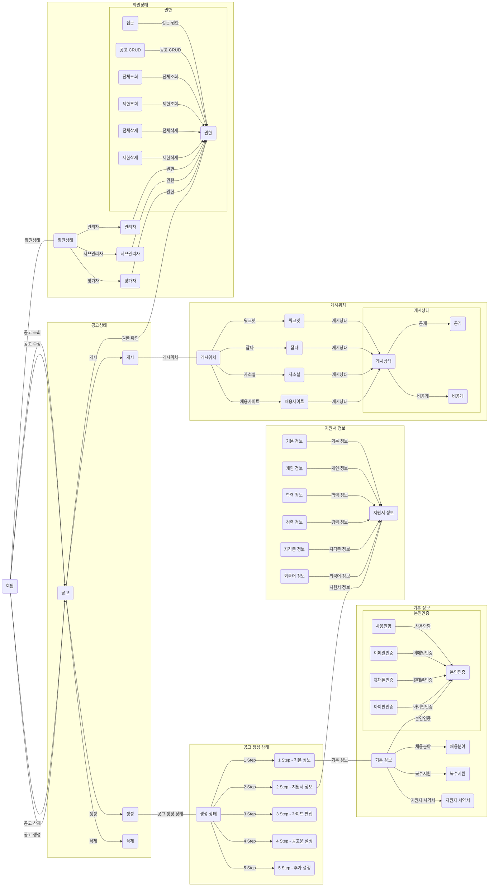
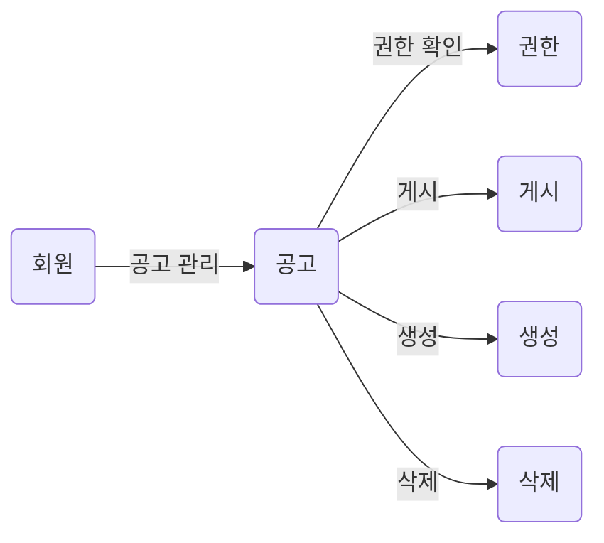

# Domain model
## 상세 도메인 다이어 그램 - 공고 생성

```mermaid
flowchart LR
    Member(회원)
    MemberStatus(회원상태)
    Admin(관리자)
    SubAdmin(서브관리자)
    Valuer(평가자)
    Authority(권한)
    Access(접근)
    RecruitNoticeCRUD(공고 CRUD)
    AllRead(전체조회)
    OwnRead(제한조회)
    AllDelete(전체삭제)
    OwnDelete(제한삭제)
    RecruitNotice(공고)
    Posting(게시)
    Delete(삭제)
    Create(생성)
    PostingStatus(게시상태)
    PostingLocation(게시위치)
    Jasoseol(자소설)
    Worknet(워크넷)
    Jobda(잡다)
    Show(공개)
    Hide(비공개)
    RecruitSite(채용사이트)
    CreateStatus(생성 상태)
    %% Step1 - 기본 정보
    RecruitNoticeStep1(1 Step - 기본 정보)
    RecruitBasicInfo(기본 정보)
    RecruitSector(채용분야)
    RecruitMultipleApply(복수지원)
    RecruitSubmitOauth(지원자 서약서)
    RecruitIdentityVerification(본인인증)
    NotUse(사용안함)
    EmailVerification(이메일인증)
    SMSVerification(휴대폰인증)
    IPinVerification(아이핀인증)
    %% Step2 - 지원서 정보
    RecruitNoticeStep2(2 Step - 지원서 정보)
    ResumeInfo(지원서 정보)
    ResumeBasicInfo(기본 정보)
    ResumePersonalInfo(개인 정보)
    ResumeEducationInfo(학력 정보)
    ResumeCareerInfo(경력 정보)
    ResumeCertificateInfo(자격증 정보)
    ResumeLanguageInfo(외국어 정보)
    %% Step3 - 가이드 편집
    RecruitNoticeStep3(3 Step - 가이드 편집)
    %% Step4 - 공고문 설정
    RecruitNoticeStep4(4 Step - 공고문 설정)
    %% Step5 - 추가 설정
    RecruitNoticeStep5(5 Step - 추가 설정)
    
    Member---|회원상태|MemberStatus
    subgraph 회원상태
        direction LR
        MemberStatus-->|관리자|Admin
        MemberStatus-->|서브관리자|SubAdmin
        MemberStatus-->|평가자|Valuer
        Admin-->|권한|Authority
        SubAdmin-->|권한|Authority
        Valuer-->|권한|Authority
        subgraph 권한
            direction LR
            Access-->|접근 권한|Authority
            RecruitNoticeCRUD-->|공고 CRUD|Authority
            AllRead-->|전체조회|Authority
            OwnRead-->|제한조회|Authority
            AllDelete-->|전체삭제|Authority
            OwnDelete-->|제한삭제|Authority
        end
    end
    Member-->|공고 조회|RecruitNotice
    Member-->|공고 수정|RecruitNotice
    Member-->|공고 삭제|RecruitNotice
    Member-->|공고 생성|RecruitNotice
    subgraph 공고상태
        direction LR
        RecruitNotice-->|권한 확인|Authority
        RecruitNotice-->|게시|Posting
        RecruitNotice-->|생성|Create
        RecruitNotice-->|삭제|Delete
    end
    Create---|공고 생성 상태|CreateStatus
    subgraph 공고 생성 상태 
        direction LR
        CreateStatus-->|1 Step|RecruitNoticeStep1
        CreateStatus-->|2 Step|RecruitNoticeStep2
        CreateStatus-->|3 Step|RecruitNoticeStep3
        CreateStatus-->|4 Step|RecruitNoticeStep4
        CreateStatus-->|5 Step|RecruitNoticeStep5
    end
    RecruitNoticeStep1---|기본 정보|RecruitBasicInfo
    subgraph 기본 정보
        direction LR
        RecruitBasicInfo-->|채용분야|RecruitSector
        RecruitBasicInfo-->|복수지원|RecruitMultipleApply
        RecruitBasicInfo-->|지원자 서약서|RecruitSubmitOauth
        RecruitBasicInfo-->|본인인증|RecruitIdentityVerification
        subgraph 본인인증
            direction LR
            NotUse-->|사용안함|RecruitIdentityVerification
            EmailVerification-->|이메일인증|RecruitIdentityVerification
            SMSVerification-->|휴대폰인증|RecruitIdentityVerification
            IPinVerification-->|아이핀인증|RecruitIdentityVerification
        end
    end
    RecruitNoticeStep2---|지원서 정보|ResumeInfo
    subgraph 지원서 정보
        direction LR
        ResumeBasicInfo-->|기본 정보|ResumeInfo
        ResumePersonalInfo-->|개인 정보|ResumeInfo
        ResumeEducationInfo-->|학력 정보|ResumeInfo
        ResumeCareerInfo-->|경력 정보|ResumeInfo
        ResumeCertificateInfo-->|자격증 정보|ResumeInfo
        ResumeLanguageInfo-->|외국어 정보|ResumeInfo
    end
    Posting---|게시위치|PostingLocation
    subgraph 게시위치
        direction LR
        PostingLocation-->|워크넷|Worknet
        PostingLocation-->|잡다|Jobda
        PostingLocation-->|자소설|Jasoseol
        PostingLocation-->|채용사이트|RecruitSite
        Worknet-->|게시상태|PostingStatus
        Jobda-->|게시상태|PostingStatus
        Jasoseol-->|게시상태|PostingStatus
        RecruitSite-->|게시상태|PostingStatus
        subgraph 게시상태
            direction LR
            PostingStatus-->|공개|Show
            PostingStatus-->|비공개|Hide
        end
    end

```
## 추상화 도메인 다이어그램

```mermaid
flowchart LR
    Member(회원)
    RecruitNotice(공고)
    Posting(게시)
    Delete(삭제)
    Create(생성)
    Authority(권한)

    Member-->|공고 관리|RecruitNotice
    RecruitNotice-->|권한 확인|Authority
    RecruitNotice-->|게시|Posting
    RecruitNotice-->|생성|Create
    RecruitNotice-->|삭제|Delete
    
    
```
