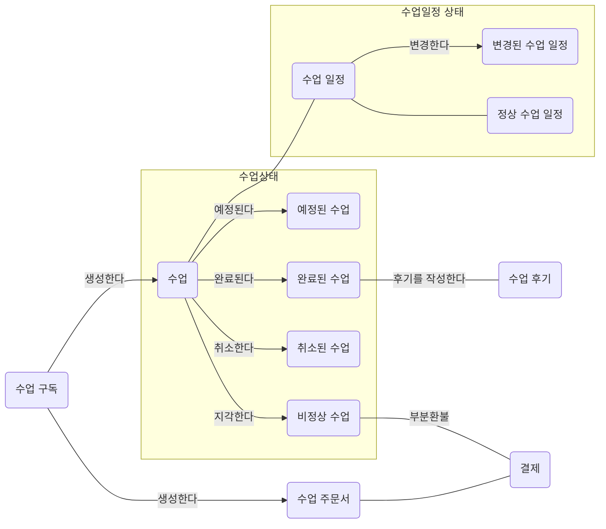
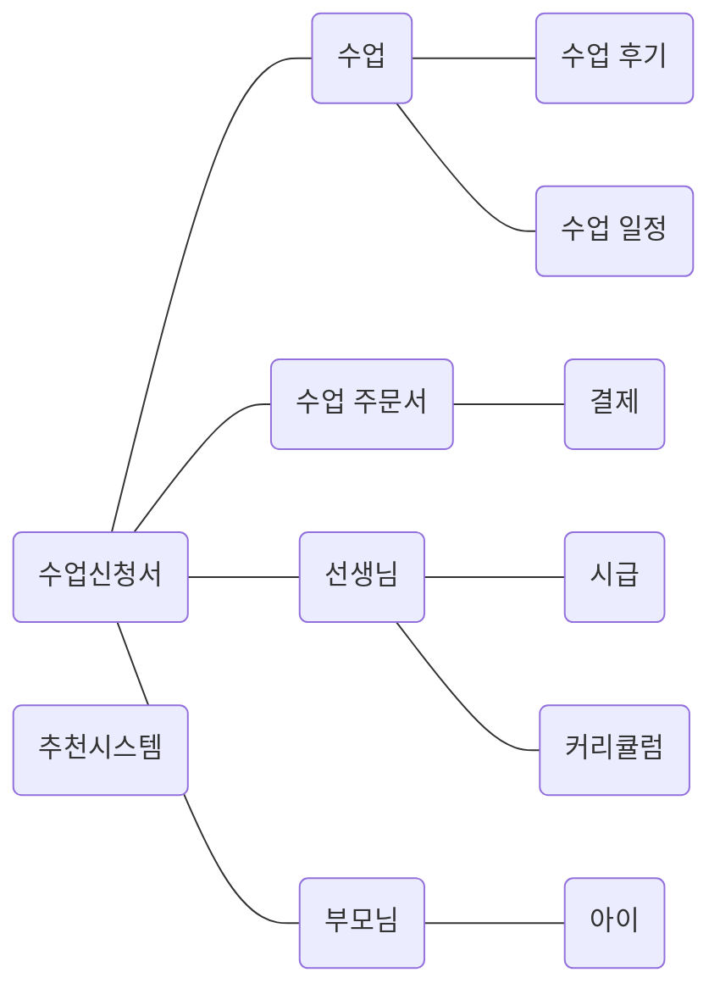

# Domain model
## 상세 도메인 다이어 그램

```mermaid
flowchart LR

    registrationSheet(수업 주문서)

    payment(결제)

    lesson(수업)

    scheduledLesson(예정된 수업)
    completedLesson(완료된 수업)
    cancelledLesson(취소된 수업)
    abnormalLesson(비정상 수업)

    lesson---lessonScheule(수업 일정)

    registrationSheet---payment

    lessionSubscribtion(수업 구독)
    lessionSubscribtion-->|생성한다|lesson

    review(수업 후기)
    completedLesson---|후기를 작성한다|review
    lessionSubscribtion-->|생성한다|registrationSheet
    abnormalLesson---|부분환불|payment

    subgraph 수업상태
        direction LR
        lesson-->|예정된다|scheduledLesson
        lesson-->|완료된다|completedLesson
        lesson-->|취소한다|cancelledLesson
        lesson-->|지각한다|abnormalLesson
    end
    subgraph 수업일정 상태
        direction LR
        lessonScheule-->|변경한다|rescheduledLessonSchedule(변경된 수업 일정)
        lessonScheule---scheduledLessonScheule(정상 수업 일정)
    end
```
## 추상화 도메인 다이어그램

```mermaid
flowchart LR
    registration(수업신청서)
    registrationSheet(수업 주문서)

    teacher(선생님)
    wage(시급)
    curriculum(커리큘럼)

    parent(부모님)
    child(아이)

    recommendation(추천시스템)

    payment(결제)

    lesson(수업)
    lessonSchedule(수업 일정)
    lessonReview(수업 후기)

    registration---lesson
    registration---registrationSheet
    registration---teacher
    registration---parent---child

    teacher---wage
    teacher---curriculum

    registrationSheet---payment


    lesson---lessonReview
    lesson---lessonSchedule

```
