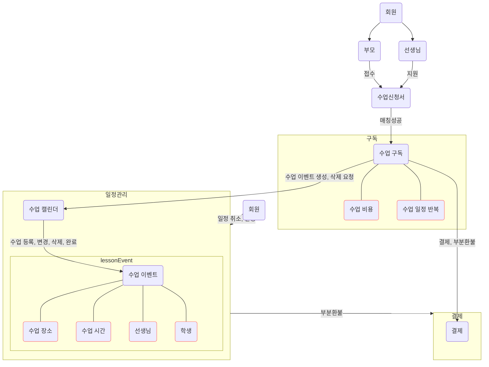

# Domain model
## 상세 도메인 다이어 그램

```mermaid
flowchart TD
%% 회원
    Member(회원)
    Parent(부모)
    Teacher(선생님)

%% 구독
    registration(수업신청서)
    subscription(수업 구독)

%% 수업
    LessonEvent(수업 이벤트)
    LessonCalendar(수업 캘린더)
    LessonPlan(수업 비용)
    LessonPlace(수업 장소)
    LessonScheduleRecurring(수업 일정 반복)
    LessonPayment(결제)
    LessonTime(수업 시간)

%% 회원의 신청서 접수
    Member --> Parent
    Member --> Teacher
    Parent -->|접수| registration
    Teacher -->|지원| registration

%% 매칭 후 구독 생성
    registration -->|매칭성공| subscription

    subgraph 구독
        direction TB
        subscription --- LessonPlan
        subscription --- LessonScheduleRecurring

    %% style
        style LessonPlan stroke:#f66
        style LessonScheduleRecurring stroke:#f66
    end

    subgraph payment[결제]
        subscription -->|결제, 부분환불| LessonPayment
    end

    subgraph 일정관리
        subscription -->|수업 이벤트 생성, 삭제 요청| LessonCalendar
        LessonCalendar -->|수업 등록, 변경, 삭제, 완료| LessonEvent
        subgraph lessonEvent
            LessonEvent --- LessonPlace
            LessonEvent --- LessonTime
            LessonEvent --- LessonEventTeacher(선생님)
            LessonEvent --- LessonEventChild(학생)

        %% style
            style LessonPlace stroke:#f66
            style LessonTime stroke:#f66
            style LessonEventTeacher stroke:#f66
            style LessonEventChild stroke:#f66
        end
    end

%% 회원의 일정 관리
    member(회원) -->|일정 취소, 변경| 일정관리
%% 회원의 주문 클레임
    일정관리 -->|부분환불| payment

```
