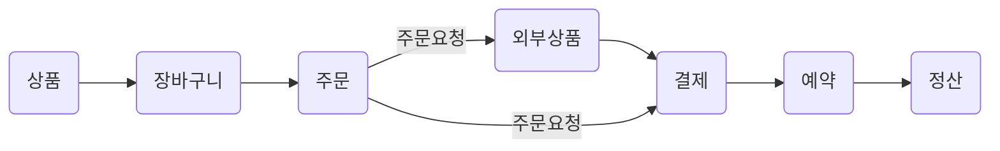
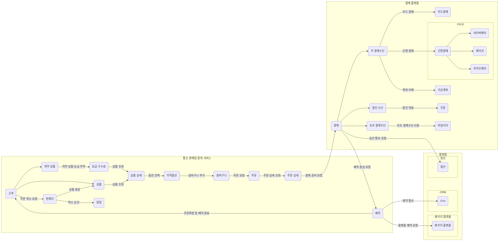

# Domain model
## 결제

## 추상화 도메인 다이어 그램

```mermaid
    flowchart LR
    PRODUCT(상품)
    CART(장바구니)
    ORDER(주문)
    PAY(결제)
    ORDER_API_IN(외부상품)
    RESERVATION(예약)
    SETTLEMENT(정산)
    PRODUCT --> CART
    CART --> ORDER -->|주문요청| ORDER_API_IN
    ORDER_API_IN --> PAY
    ORDER -->|주문요청| PAY --> RESERVATION
    RESERVATION --> SETTLEMENT
```
---
## 상세 도메인 다이어그램

```mermaid
   flowchart LR
    User(고객)
    Seller(판매자)
    Product(상품)
    Notify(알림)
    Option(가격옵션)
    ApiProduct(외부 상품)
    ProductDetail(상품 상세)
    MarkUp(요금 수수료)
    Cart(장바구니)
    Order(주문)
    Crm(Crm)
    OrderDetail(주문 상세)
    Reservation(예약)
    Payment(결제)
    Card(카드결제)
    EasyPay(간편결제)
    Mileage(마일리지)
    VirtualAccount(가상계좌)
    MainAccount(주 결제수단)
    Coupon(쿠폰)
    PackagePlatForm(패키지 플랫폼)
    Settlement(정산)

    subgraph "통신 판매업 중개 서비스"
        direction TB
        Seller -->|상품 생성| Product
        User --> ApiProduct
        User --> Product
        ApiProduct -->|외부 상품 요금 부여| MarkUp -->|상품 조회| ProductDetail
        Product -->|상품 조회| ProductDetail -->|옵션 선택| Option -->|장바구니 추가| Cart
        Cart -->|주문 요청| Order
        Order -->|주문 상세 조회| OrderDetail
        Seller
        Notify
        Reservation
    end

    subgraph "결제 플랫폼"
        direction TB
        Payment --> MainAccount
        MainAccount -->|카드 결제| Card
        MainAccount -->|간편 결제| EasyPay
        MainAccount -->|계좌 이체| VirtualAccount
        Payment --> DisCount(할인 수단)
        DisCount -->|할인 적용| Coupon
        Payment --> SubAccount(보조 결제수단)
        SubAccount -->|보조 결제수단 사용| Mileage
        subgraph "PG사"
            direction TB
            EasyPay --> NaverPay(네이버페이)
            EasyPay --> Payco(페이코)
            EasyPay --> KAKAO(카카오페이)
        end
    end

    subgraph "플랫폼"
        direction TB
        subgraph 패키지 플랫폼
            direction TB
            PackagePlatForm
        end
        subgraph "CRM"
            direction TB
            Crm
        end
        subgraph "정산"
            direction TB
            Payment -->|승인 통보 요청| Settlement
        end
    end

    OrderDetail -->|결제 준비 요청| Payment
    Payment -->|예약 생성 요청| Reservation
    Reservation --> |예약 통보|Crm
    Reservation --> |플랫폼 예약 요청|PackagePlatForm
    Reservation --> |주문확정 및 예약 완료|User
    User -->|주문 취소 요청| Seller
    Seller -->|취소 승인| Notify
    Notify
```
