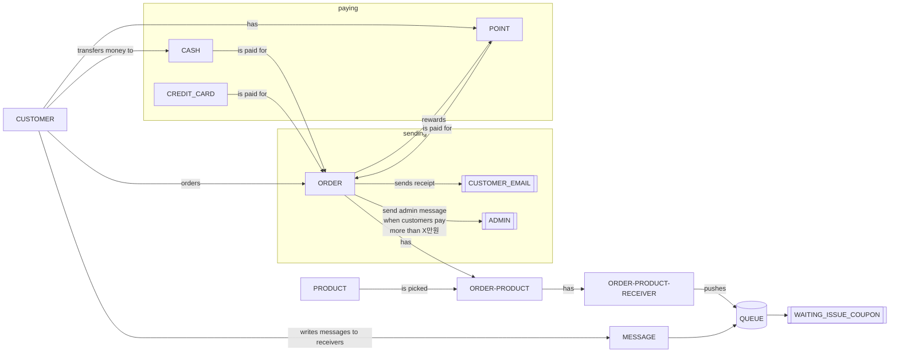

## 시스템 구조

```mermaid
flowchart LR
    CUSTOMER-- orders --> ORDER
    ORDER-- has --> ORDER-PRODUCT
    ORDER-PRODUCT-- has --> ORDER-PRODUCT-RECEIVER
    ORDER-PRODUCT-RECEIVER -- pushes --> QUEUE[(QUEUE)] --> WAITING_ISSUING_COUPON[[WAITING_ISSUE_COUPON]]   
    PRODUCT-- is picked --> ORDER-PRODUCT

    CUSTOMER -- writes messages to receivers--> MESSAGE --> QUEUE
        
    subgraph sending
    ORDER -- sends receipt --> CUSTOMER_EMAIL[[CUSTOMER_EMAIL]]
    ORDER -- send admin message\n when customers pay \nmore than X만원  --> ADMIN[[ADMIN]]
    end

    subgraph paying
    POINT -- is paid for --> ORDER
    ORDER -- rewards --> POINT
    CASH -- is paid for --> ORDER
    CREDIT_CARD -- is paid for --> ORDER
    end

    CUSTOMER -- transfers money to  --> CASH
    CUSTOMER -- has --> POINT
```
