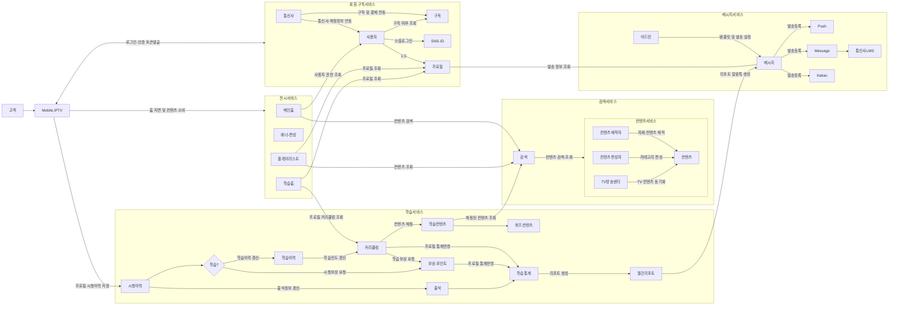
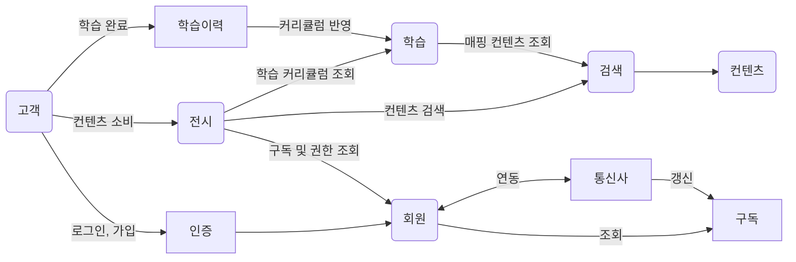

# Domain model
## 학습 및 OTT 서비스
모바일과 IPTV에서 `동영상, 독서, 학습컨텐츠(VOD,HTML5)` 등을 제공해주는 앱입니다.
아래 그림에서 각 서비스별로 팀이 나뉘어져있습니다.

## 상세 도메인 다이어 그램
- 앱 진입 시 메인 홈/학습 홈이 나뉘어져있습니다.
- 메인 홈에서는 내 플레이리스트, 홈 지면, 이벤트 배너등을 제공합니다. 
- 학습 홈에서는 프로필별로 다른 커리큘럼 진도를 가진 학습 컨텐츠를 제공해줍니다.

## 추상화된 다이어그램

