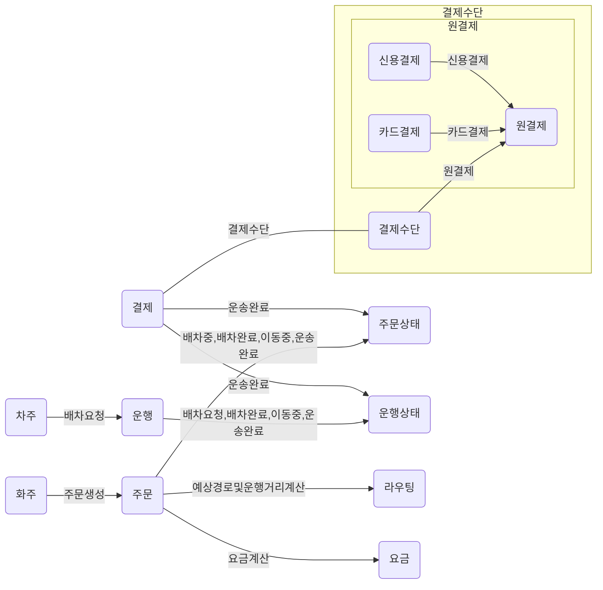
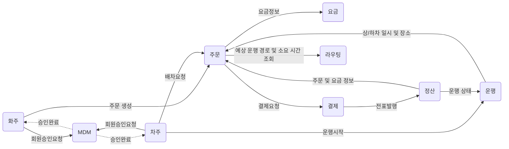

# Domain model

## 상세 도메인 다이어 그램

### 배차에 대한 상세 도메인 다이어 그램

```mermaid
flowchart LR
        Owner(화주)
        Driver(차주)
        Order(주문)
        Order_Status(주문상태)
        Driving_Vehicle(운행)
        Driving_Vehicle_Status(운행상태)
        Payment(결제)
        PaymentMethod(결제수단)
        FundingSource(원결제)
        Card(카드결제)
        CreditPayment(신용결제)
        Routing(라우팅)
        Pricing(요금)
        Owner-->|주문생성|Order
        Order-->|예상경로및운행거리계산|Routing
        Order-->|요금계산|Pricing
        Order-->|배차중,배차완료,이동중,운송완료|Order_Status
        Driver-->|배차요청|Driving_Vehicle
        Driving_Vehicle-->|배차요청,배차완료,이동중,운송완료|Driving_Vehicle_Status
        Payment-->|운송완료|Driving_Vehicle_Status
        Payment-->|운송완료|Order_Status
        Payment ---|결제수단|PaymentMethod
        subgraph 결제수단
        direction TB
        PaymentMethod-->|원결제|FundingSource
            subgraph 원결제
            direction TB
            Card-->|카드결제|FundingSource
            CreditPayment-->|신용결제|FundingSource
            CreditPayment(신용결제)
            end
        end
```

## 추상화 도메인 다이어그램

```mermaid
flowchart LR
        Owner(화주)
        Driver(차주)
        MDM(MDM)
        Sattlement(정산)
        Order(주문)
        Pricing(요금)
        DrivingVehicle(운행)
        Pay(결제)
        Routing(라우팅)
        Owner-->|회원승인요청|MDM
        MDM-.승인완료.->Owner
        Driver-->|회원승인요청|MDM
        MDM-.승인완료.->Driver
        Owner-->|주문 생성|Order
        Order-->|예상 운행 경로 및 소요 시간 조회|Routing
        Order-->|요금정보|Pricing
        Driver-->|배차요청|Order
        Driver-->|운행시작|DrivingVehicle
        DrivingVehicle-->|상/하차 일시 및 장소|Order
        Order-->|결제요청|Pay
        Sattlement-->|주문 및 요금 정보|Order
        Sattlement-->|운행 상태|DrivingVehicle
        Pay-->|전표발행|Sattlement
```
