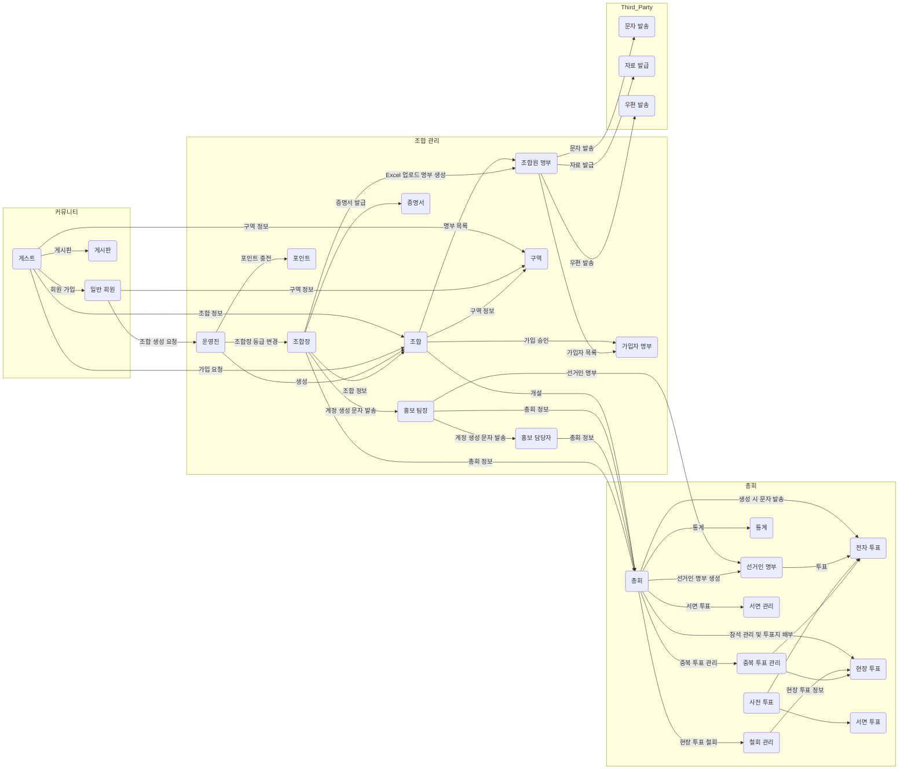
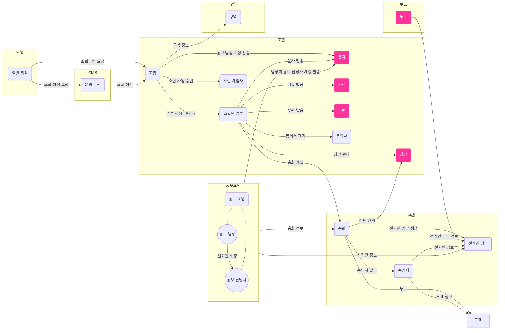
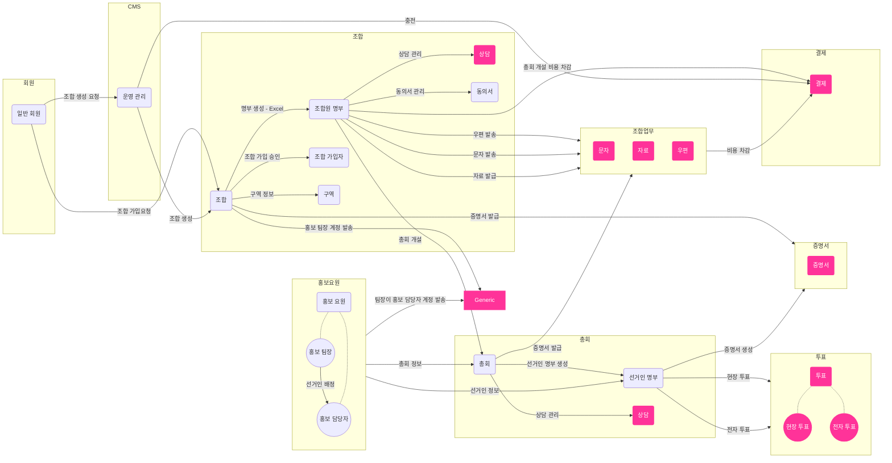

### 리팩토링1 포인트
- 도메인은 명사로 생각해보고, 행위는 Line에 표현해보자.
- 테이블에 명확히 표현되는 데이터를 기준으로 도메인을 뽑아보자.
- 추상화가 많이 되어도 신경쓰지 말아보자.
- 단기간에 잘할 수 없다는 것을 인정하고 그리자.
- 현재 이정도 그릴 수 있는 것만해도 전체 시스템을 대략 알고 있는 것으로 업무에는 큰 도움이 된다.
- 아무래도 처음와서 상세하게 코드를 까봐서 이미 지식이 있기 때문에 더욱 상세하게 그려지는 것 같다.
- 리팩토링2에서 한 번 더 리팩토링을 할건데 해당 차트에서 빨간색이 최종본에서 리팩토링될 포인트이다. 

### 리팩토링 2 포인트
- 상담을 조합과 총회가 별도로 데이터를 갖도록 테이블 자체를 분리하는 컨셉
- 조합과 총회를 아예 분리. 실제 프로세스는 조합원 명부를 기반으로 체크박스로 선택해서 선거인명부를 복사해서 총회에 선거인명부를 생성하는데 도메인 상으로는 크게 연관이 없는 것 같아 분리.
  조합원 명부도 엑셀로 업로드하는데 선거인 명부도 그런 개념으로 생각해서 하면 분리가 된다고 생각
- 문자, 자료, 우편을 별도의 제네릭한 느낌의 도메인으로 도출
- 투표도 별도의 테이블이 있기 때문에 도출
