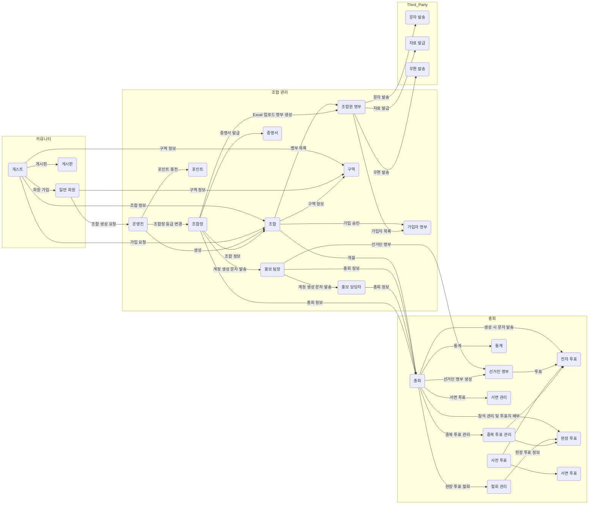

```mermaid
flowchart LR
    subgraph 조합 관리
        Union_Regi(조합원 명부)
        Union(조합)
        Admin(운영진)
        Certificate(증명서)
        Union_Member_Regi(가입자 명부)
        Union_Leader(조합장)
        Zone(구역)
        Point(포인트)
        Promotion_Leader(홍보 팀장)
        Promotion_Manager(홍보 담당자)
    end
    subgraph 총회
        Meeting(총회)
        Meet_Participant(선거인 명부)
        Electronic_Voting(전자 투표)
        Onsite_Voting(현장 투표)
        Statistics(통계)
        Revocation_Management(철회 관리)
        Written_Management(서면 관리)
        Dup_Voting_Management(중복 투표 관리)
        Early_Voting(사전 투표)
        Revocation_Voting(서면 투표)
    end
    subgraph 커뮤니티
        Guest(게스트)
        Member(일반 회원)
        Board(게시판)
    end
    subgraph Third_Party
        Sms(문자 발송)
        Materials(자료 발급)
        Address(우편 발송) 
    end

    Guest --> |구역 정보| Zone
    Guest --> |조합 정보| Union
    Guest --> |회원 가입| Member
    Guest --> |게시판| Board
    Guest --> |가입 요청| Union
    Member --> |구역 정보| Zone
    Member --> |조합 생성 요청| Admin
    Admin --> |생성| Union
    Admin --> |조합장 등급 변경| Union_Leader 
    Admin --> |포인트 충전| Point 
    Union --> |개설| Meeting
    Union --> |명부 목록| Union_Regi
    Union --> |구역 정보| Zone
    Union --> |가입 승인| Union_Member_Regi
    Promotion_Leader --> |총회 정보| Meeting
    Promotion_Manager --> |총회 정보| Meeting
    Promotion_Leader --> |계정 생성 문자 발송| Promotion_Manager
    Promotion_Leader --> |선거인 명부| Meet_Participant
    Union_Leader --> |증명서 발급| Certificate
    Union_Leader --> |총회 정보| Meeting
    Union_Leader --> |조합 정보| Union
    Union_Leader --> |Excel 업로드 명부 생성| Union_Regi
    Union_Leader --> |계정 생성 문자 발송| Promotion_Leader
    Union_Regi --> |문자 발송| Sms
    Union_Regi --> |자료 발급| Materials
    Union_Regi --> |우편 발송| Address
    Union_Regi --> |가입자 목록| Union_Member_Regi
    Meeting --> |참석 관리 및 투표지 배부| Onsite_Voting
    Meeting --> |생성 시 문자 발송| Electronic_Voting
    Meeting --> |선거인 명부 생성| Meet_Participant
    Meeting --> |통계| Statistics
    Meeting --> |현장 투표 철회| Revocation_Management
    Meeting --> |서면 투표| Written_Management
    Meeting --> |중복 투표 관리| Dup_Voting_Management
    Meet_Participant --> |투표| Electronic_Voting
    Revocation_Management --> |현장 투표 정보| Onsite_Voting
    Early_Voting --> Electronic_Voting
    Early_Voting --> Revocation_Voting
    Dup_Voting_Management --> Onsite_Voting
    Dup_Voting_Management --> Electronic_Voting
```