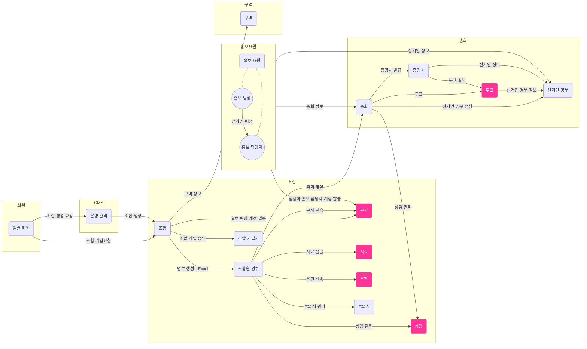

### 리팩토링1 포인트
- 도메인은 명사로 생각해보고, 행위는 Line에 표현해보자.
- 테이블에 명확히 표현되는 데이터를 기준으로 도메인을 뽑아보자.
- 추상화가 많이 되어도 신경쓰지 말아보자.
- 단기간에 잘할 수 없다는 것을 인정하고 그리자.
- 현재 이정도 그릴 수 있는 것만해도 전체 시스템을 대략 알고 있는 것으로 업무에는 큰 도움이 된다.
- 아무래도 처음와서 상세하게 코드를 까봐서 이미 지식이 있기 때문에 더욱 상세하게 그려지는 것 같다.
- 리팩토링2에서 한 번 더 리팩토링을 할건데 해당 차트에서 빨간색이 최종본에서 리팩토링될 포인트이다. 
