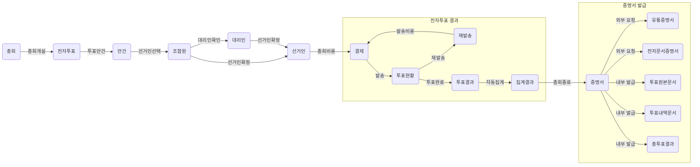
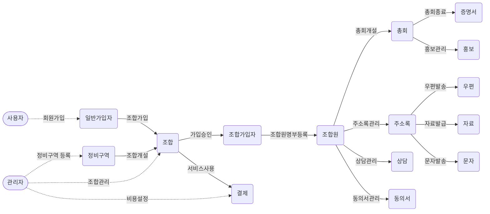

# Domain model
## 상세 도메인 모델

```mermaid
flowchart LR
    Meet(총회)
    Electronic(전자투표)
    Agenda(안건)
    UnionRegister(조합원)
    Participant(선거인)
    Agent(대리인)
    Payment(결제)
    VoteStatus(투표현황)
    Resend(재발송)
    VoteResult(투표결과)
    Calculate(집계결과)
    Certificate(증명서)
    Distribution(유통증명서)
    Online(전자문서증명서)
    OriginDoc(투표원본문서)
    VoteDoc(투표내역문서)
    VoteTotal(총투표결과)
    
    Meet-->|총회개설|Electronic
    Electronic-->|투표안건|Agenda
    Agenda-->|선거인선택|UnionRegister
    UnionRegister-->|선거인확정|Participant
    UnionRegister-->|대리인확인|Agent
    Agent-->|선거인확정|Participant
    Participant-->|총회비용|Payment
    Payment-->|발송|VoteStatus
        subgraph 전자투표 결과
            VoteStatus-->|재발송|Resend
            VoteStatus-->|투표완료|VoteResult
            Resend-->|발송비용|Payment
            VoteResult-->|자동집계|Calculate
        end
    Calculate-->|총회종료|Certificate
        subgraph 증명서 발급
            Certificate-->|외부 요청|Distribution
            Certificate-->|외부 요청|Online
            Certificate-->|내부 발급|OriginDoc
            Certificate-->|내부 발급|VoteDoc
            Certificate-->|내부 발급|VoteTotal
        end

```
## 추상 도메인 모델

```mermaid
flowchart LR
    Admin([관리자])
    User([사용자])
    BizZone(정비구역)
    Union(조합)
    Member(일반가입자)
    UnionMember(조합가입자)
    UnionRegister(조합원)
    Address(주소록)
    Meet(총회)
    Certificate(증명서)
    Promotion(홍보)
    Post(우편)
    Document(자료)
    Sms(문자)
    Counsel(상담)
    Agreement(동의서)
    Payment(결제)

    Admin-.->|정비구역 등록|BizZone
    Admin-.->|비용설정|Payment
    Admin-.->|조합관리|Union

    BizZone-->|조합개설|Union
    User-.->|회원가입|Member
    Member-->|조합가입|Union
    Union-->|서비스사용|Payment
    Union-->|가입승인|UnionMember
    UnionMember-->|조합원명부등록|UnionRegister

    UnionRegister-->|총회개설|Meet-->|총회종료|Certificate
    Meet-->|홍보관리|Promotion
    UnionRegister-->|주소록관리|Address-->|우편발송|Post
    Address-->|자료발급|Document
    Address-->|문자발송|Sms
    UnionRegister-->|상담관리|Counsel
    UnionRegister-->|동의서관리|Agreement
```
