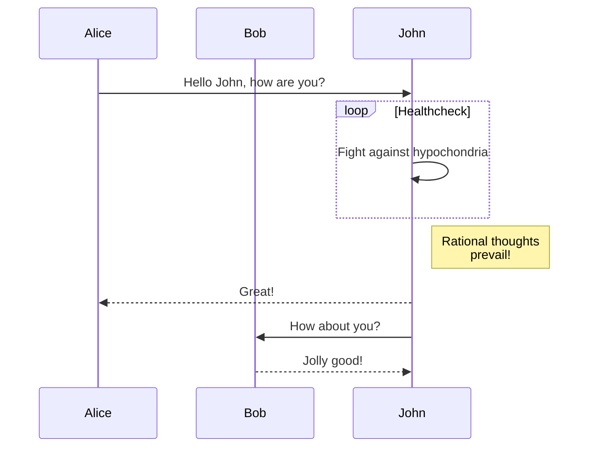

# 요구사항
- [ ] 자신의 서비스 시스템의 Profiling을 해본다.
    - [ ] Profiling 을 하면서 본인의 서비스에서 부하가 큰 class나 code를 확인해보고 그 이유를 생각 해본다.
    - [ ] Profiling을 통해서 특정 기능에 대한 sequence diagram을 작성한다.
- [ ] SpringData의 @Transactional annotation에 대하여 call stack을 확인 한다.
    - [ ] Transactional annotation에 대한 동작기제(메커니즘)을 이해한다.


# 서비스 분석
Intellij에서 profiling에 대하여 궁금하신 분은 아래의 동영상을 참고해주세요. (단, 영어입니다.)
```youtube
OQcyAtukps4
```
## Profiling


- 간단히 local에서 확인 해볼 수 있는 Profiling : JetBrains Profiler나 JProfiler
- 서비스 시스템에서의 profiling
    - local 컴퓨터에서 profiling할 때는 본인 컴퓨터의 리소스 (cpu, memory...)에 영향을 많이 받기 때문에 정확한 profiling데이터를 확보 할 수 없는 것을 이해하고 있어야한다. (코드상의 병목현상을 찾는 것이 주 목적이다.)
    - Pinpoint
    - ELK
- Application 분석
    - 메모리 분석 
    - CPU 분석
    - Thread 분석

## Call stack확인

- intellij Profiling에서 확인 해볼 수 있다.

- 참고자료 
    - [intelliJ CallTree](https://www.jetbrains.com/help/idea/read-the-profiling-report.html#profiler-call-tree)

## Sequence flow




### 🚀미션(해야할 일)
- JetBrains Profiler나 JProfiler를 통해서 본인의 서비스에 대한 profiling을 해본다.
- 생성된 profiling을 보고 추상화된 sequence diagram을 작성하고 git에 올리고 review를 진행한다.
    - 참고자료 : [Mermaid](https://mermaid.js.org/#/) (sequence diagram 작성 툴)
- Profiling된 결과를 보고 본인의 서비스에서 가장 부하가 큰 class나 code를 확인하고 정확한 원인을 이해 해 본 내용을 text 파일로 정리하여 git에 올리고 review를 진행한다.
- @Transactional annotation에 대하여 call stack을 통해서 동작기제를 정리하여 text파일로 git에 올리고 review를 진행한다.


## 참고자료
1. Java Profiling 툴 소개: [Bealdung](https://www.baeldung.com/java-profilers)
2. Intellij Profiling : [Intellij Profiling](https://blog.jetbrains.com/idea/2020/03/profiling-tools-and-intellij-idea-ultimate/)

